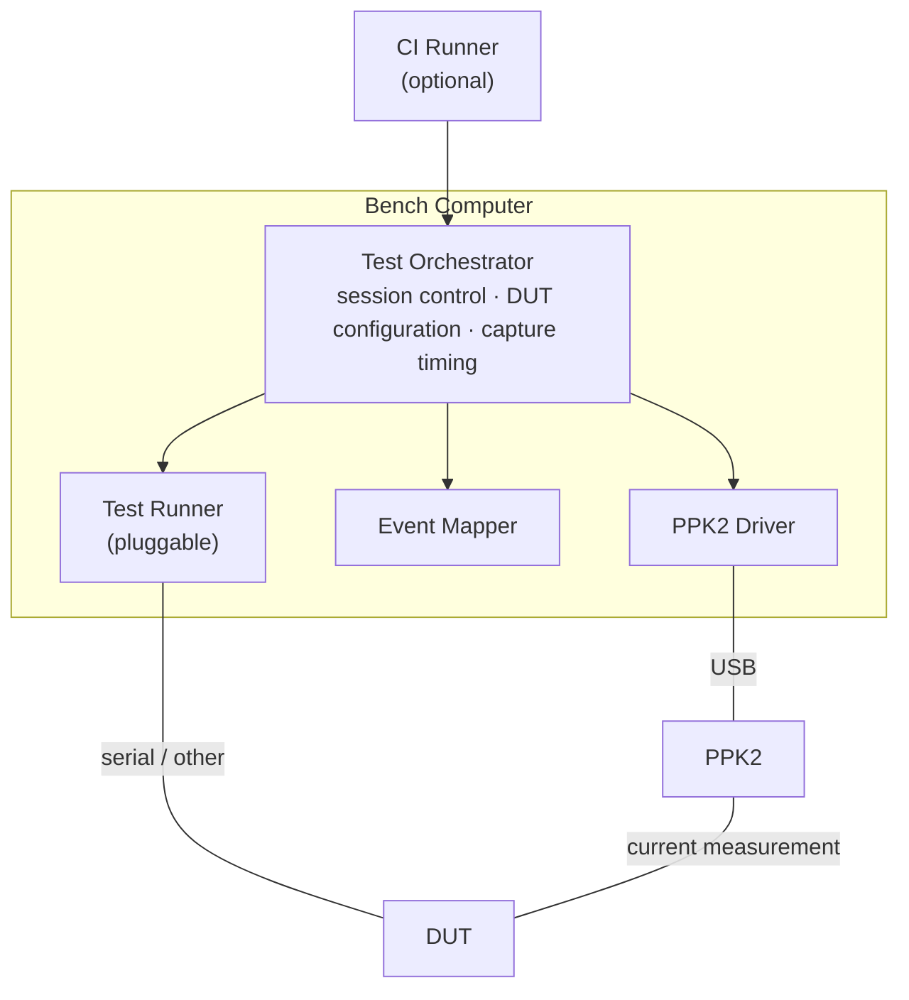
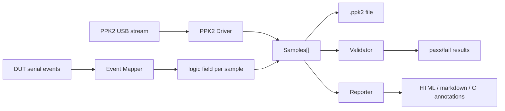
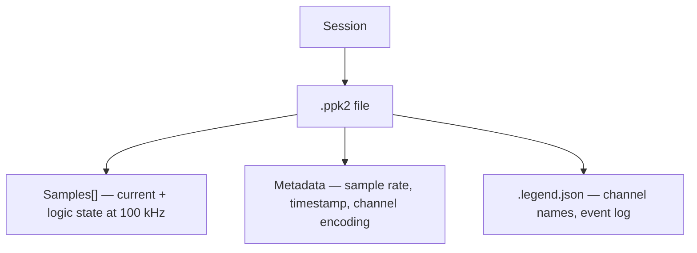
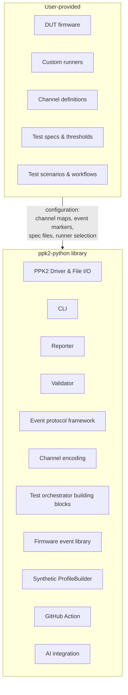

# PPK2 Python — Architecture & Glossary

This document defines the library architecture and glossary.

---

## Glossary

### Hardware

| Term | Definition |
|------|-----------|
| **PPK2** | Nordic Power Profiler Kit II. Measurement instrument that captures current at up to 100 kHz. Connects to the bench computer via USB. Operates in **source mode** (powers the DUT and measures current) or **ampere meter mode** (measures current drawn from the DUT's own supply). |
| **DUT** | Device Under Test. The target hardware being power-profiled. Any embedded system — a sensor node, wearable, gateway, etc. |
| **Bench computer** | The computer running the ppk2-python library. Connected to the PPK2 via USB and to the DUT via serial (or other transport). |

### Software actors

| Term | Definition |
|------|-----------|
| **PPK2 Driver** | `PPK2Device` class. Communicates with the PPK2 hardware — configures parameters, starts/stops capture, reads samples. |
| **Test Orchestrator** | Top-level coordinator of a test session. Starts/stops PPK2 capture, tells the DUT which tests to run, applies configuration, collects events, and produces captures. May be a script, a pytest fixture, or an interactive CLI session. Can be decomposed into sub-components for complex workflows. |
| **Test Runner** | Executes test cases against the DUT, operating under the test orchestrator. A pluggable component — the orchestrator selects the appropriate runner based on the DUT firmware interface. Custom runners can be implemented for any DUT command protocol. |
| **Event Mapper** | `EventMapper` class. Receives timestamped events from the DUT (via serial or other transport) and encodes them into the logic field of each sample. Maintains the channel encoding and state table. |
| **Validator** | Evaluates a spec against a capture. Computes per-region metrics (charge, mean, peak, duration) and returns pass/fail results. |
| **Reporter** | Generates output from captures — themed HTML reports with interactive charts, markdown tables, GitHub Actions annotations. Consumes validation results to show pass/fail. |

### Data concepts

| Term | Definition |
|------|-----------|
| **Sample** | A single ADC reading: current (µA), measurement range, logic state, counter. Captured at up to 100 kHz. |
| **Logic state** | A 16-bit value stored with each sample. Encodes which logical channels are active at that point in time. |
| **Logical channel** | A named subsystem or activity on the DUT (e.g. "RADIO_TX", "SENSOR_READ", "SLEEP"). Not tied to a physical GPIO — typically derived from DUT serial events. There can be more logical channels than physical bits (see Channel Encoding). |
| **Capture** | A continuous recording of samples over a time period, stored as a `.ppk2` file. One capture = one file. |
| **Session** | A complete test run orchestrated by the test orchestrator. May produce one or more captures. |
| **Region** | A time span within a capture defined by logical channel state (e.g. "while RADIO_TX is active"). A region may consist of multiple disjoint intervals. |
| **Activation** | A single contiguous interval where a logical channel is high. A region is the union of all activations for that channel. |
| **State** | The combination of logical channels active at a given moment, encoded as a 16-bit index in the logic field. |
| **State table** | A mapping from state index → set of active logical channels. Stored in `.ppk2` metadata. |

### Validation concepts

| Term | Definition |
|------|-----------|
| **Spec** | A set of pass/fail criteria applied to a capture or its regions. Stored as JSON alongside the `.ppk2` file. |
| **Criterion** | A single pass/fail rule: peak current, charge budget, duration limit, etc. Evaluated against a region or the entire capture. |
| **Charge** | Current integrated over time (mC or µC). Directly maps to battery capacity (mAh). The primary metric for predicting battery drain. |

---

## Architecture

### Actor relationships



### Use cases

| Use case | Test Orchestrator | Test Runner | PPK2 Mode |
|----------|-------------------|-------------|-----------|
| **CI power regression** | Automated script | Doctest or custom runner | Source or ampere meter |
| **Hardware-in-loop test** | Automated script | Custom runner for DUT protocol | Either |
| **Manual bench test** | Engineer via CLI | Interactive | Either |
| **Capture only** | `ppk2 measure` CLI | None | Either |

### Data flow



---

## Data Model



### File organization

```
capture.ppk2              — sample data (nRF Connect compatible)
capture.ppk2.legend.json  — channel names + event log
capture.ppk2.spec.json    — validation criteria (optional)
```

All three can be versioned together. The CLI loads them automatically:

```bash
ppk2 report capture.ppk2 --html report.html
# Automatically loads .legend.json and .spec.json if present
```

---

## Channel Encoding

The `.ppk2` format stores a `Uint16LE` logic field per sample — 16 bits, 65,536 possible states.

### Direct mode (≤16 logical channels)

Each bit corresponds to one logical channel. Bit 0 = channel 0, bit 1 = channel 1, etc. Multi-bit values naturally represent combinations.

- Fully backward compatible with nRF Connect Power Profiler
- Supports up to 16 independent channels
- No state table needed — bits are self-describing

### Indexed mode (>16 logical channels)

The 16-bit value is an opaque state index. A state table in metadata maps each index to the set of active logical channels.

- Supports unlimited logical channels (limited only by unique combinations observed, max 65,536)
- Not directly readable by nRF Connect

### Hybrid encoding (automatic)

The EventMapper selects the encoding automatically:

1. **≤16 logical channels** → direct mode. Each channel gets a dedicated bit.

2. **>16 logical channels** → indexed mode with backward-compatible layout:
   - Powers of 2 (1, 2, 4, ..., 32768) reserved for single-channel activations
   - Index 0 = all channels off
   - Remaining indices encode multi-channel combinations
   - Files with ≤16 channels in indexed mode look identical to direct mode

### Metadata format

Direct mode:

```json
{
  "metadata": {
    "samplesPerSecond": 100000,
    "startSystemTime": 1739000000000
  },
  "formatVersion": 2,
  "channelEncoding": {
    "mode": "direct",
    "channels": ["RADIO_TX", "SENSOR_READ", "LED"]
  }
}
```

Indexed mode:

```json
{
  "channelEncoding": {
    "mode": "indexed",
    "channels": ["RADIO_TX", "RADIO_RX", "SENSOR_A", "SENSOR_B",
                  "FLASH_WRITE", "LED", "BUZZER", "SLEEP_DEEP",
                  "SLEEP_LIGHT", "BLE_ADV", "BLE_CONN", "LTE_TX",
                  "LTE_RX", "ADC_READ", "I2C_XFER", "SPI_XFER",
                  "DMA_ACTIVE", "USB_ENUM"],
    "stateTable": {
      "0": [],
      "1": ["RADIO_TX"],
      "2": ["RADIO_RX"],
      "3": ["RADIO_TX", "SENSOR_A"],
      "5": ["RADIO_TX", "BLE_ADV"]
    }
  }
}
```

---

## Metrics & Validation

Analysis is split into two distinct stages: **derive** metrics from the capture, then **validate** those metrics against thresholds. The stages are conceptually separate — metrics can be computed without validation (for dashboards, trend tracking, exploration), and thresholds can be applied to pre-computed metrics without re-deriving.

The ppk2 CLI bundles derivation + validation for convenience:

```bash
ppk2 validate capture.ppk2 --spec thresholds.yaml   # derives + validates in one step
ppk2 metrics capture.ppk2                            # derives only, outputs JSON
```

### Stage 1: Metric derivation

Computes aggregate values from a capture, scoped to regions defined by logical channel state. Pure data transformation — no judgement.

Metrics are computed per scope (region) and globally:

| Metric | Unit | Description |
|--------|------|-------------|
| `peak_ma` / `peak_ua` | mA / µA | Maximum instantaneous current |
| `mean_ma` / `mean_ua` | mA / µA | Average current |
| `charge_mc` / `charge_uc` | mC / µC | Integrated current × time |
| `duration_s` | s | Total time a channel is active |
| `charge_mc_per_activation` | mC | Charge per individual activation |
| `activations` | count | Number of times a channel transitions high |

#### Region definitions

- **Named channel** (e.g. `"RADIO_TX"`) — all intervals where that logical channel is active
- **`all_off`** — all intervals where no logical channels are active
- **`any_on`** — all intervals where at least one logical channel is active
- **Combination** (e.g. `"RADIO_TX+SENSOR_READ"`) — intervals where both are simultaneously active

#### Example output

```json
{
  "global": {
    "peak_ma": 142.3,
    "mean_ma": 18.5,
    "charge_mc": 1.85,
    "duration_s": 12.4
  },
  "scopes": {
    "upload": {
      "peak_ma": 142.3,
      "mean_ma": 42.1,
      "charge_mc": 0.63,
      "duration_s": 1.2,
      "activations": 3,
      "charge_mc_per_activation": 0.21
    },
    "gps_fix": {
      "mean_ma": 25.4,
      "charge_mc": 0.89
    },
    "all_off": {
      "mean_ua": 8.2,
      "peak_ua": 47.0
    }
  }
}
```

This output is reusable: it feeds validation, CI trend tracking, dashboards, anomaly detection, and reports.

### Stage 2: Threshold validation

Compares derived metrics against pass/fail thresholds. Pure comparison — no data access.

```yaml
# thresholds.yaml
upload:
  peak_ma: { max: 150 }
  charge_mc: { max: 0.8 }
gps_fix:
  charge_mc_per_activation: { max: 0.5 }
all_off:
  mean_ua: { max: 50 }
  peak_ua: { max: 500 }
```

Different threshold files can target different scenarios:
- Per hardware revision (MPCB 1.9 vs 1.10 have different power budgets)
- Per deployment (field vs lab)
- Per build variant (debug vs release)

### Why charge over current?

Current is instantaneous — it doesn't capture duration. A 50 mA radio burst that takes 10 ms costs the same charge as a 5 mA transmission that takes 100 ms, but the battery impact is identical. Charge (mC = mA × s) directly maps to battery capacity (mAh) and predicts battery life.

Peak current remains useful as a hardware safety limit — detecting stuck peripherals, unexpected wakeups, or supply violations.

Mean current is useful for idle/sleep baseline validation where duration is essentially unbounded — here charge and mean are proportional and mean is more intuitive.

---

## Report Visualization

Derived metrics and validation results appear in reports:

- **Summary table** — per-scope metrics with pass/fail status and actual vs. threshold values
- **Region shading** — subtle colored bands on the time axis showing where each region is active
- **Threshold lines** — horizontal lines within region bounds showing the budget as an equivalent mean current
- **Charge annotation** — area under the curve within a region, with running total

---

## Event Protocol

The DUT emits timestamped events over serial (or other transport). The format is configurable via the EventMapper:

```
T=0.500 RADIO_TX_STARTED
T=0.650 RADIO_TX_STOPPED
T=1.200 SENSOR_READ_STARTED
T=1.205 SENSOR_READ_STOPPED
```

Default markers: `_STARTED` / `_STOPPED`, prefix `T=`. All configurable:

```python
mapper = parse_serial_events(
    serial_output,
    channel_map={"RADIO_TX": 0, "SENSOR_READ": 1},
    start_marker="_STARTED",
    stop_marker="_STOPPED",
    timestamp_prefix="T=",
)
```

A firmware-side C/C++ library is provided for DUT firmware to emit events in this format.

---

## Extensibility Model

The library separates generic infrastructure from product-specific configuration. The generic layer ships with the library; product-specific components are provided by the user.

### Library components

| Component | Description |
|-----------|-------------|
| **ppk2-python** | PPK2 driver, .ppk2 file I/O, ADC conversion, spike filtering |
| **Reporter** | Themed HTML reports, markdown tables, GitHub Actions annotations |
| **Validator** | Spec evaluation, region-based criteria, charge/current/duration checks |
| **Event protocol framework** | Configurable event format (markers, timestamps, transport) |
| **Channel encoding** | Direct/indexed/hybrid encoding with automatic mode selection |
| **Test orchestrator building blocks** | Capture controller, session controller, DUT controller interfaces |
| **PlatformIO test runner plugin** | Disconnect/reconnect during hardware-in-the-loop tests |
| **Firmware event library** | C/C++ library for DUT firmware to emit timestamped events |
| **Synthetic ProfileBuilder** | Test data generation for CI and documentation |
| **CLI** | `ppk2 measure`, `ppk2 report`, `ppk2 info`, `ppk2 open` |
| **GitHub Action** | Power profiling reports in CI workflows |
| **AI integration** | Profile generation, analysis, and validation via Claude |

### User-provided components

| Component | Description |
|-----------|-------------|
| **DUT firmware** | Application and test firmware for the specific product |
| **Custom test runners** | Runners that understand the product's DUT command protocol |
| **Channel definitions** | Which logical channels exist for the product |
| **Test specs** | Pass/fail thresholds for specific hardware revisions |
| **Test scenarios** | Orchestration scripts for specific test sequences |
| **Production workflows** | Manufacturing, calibration, and QA procedures |

### The boundary



A new product uses the generic layer with its own channel definitions, specs, and orchestration — no library modifications needed.
