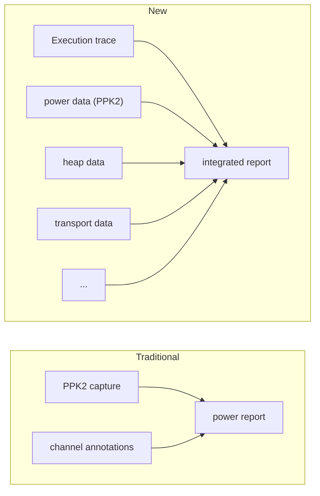
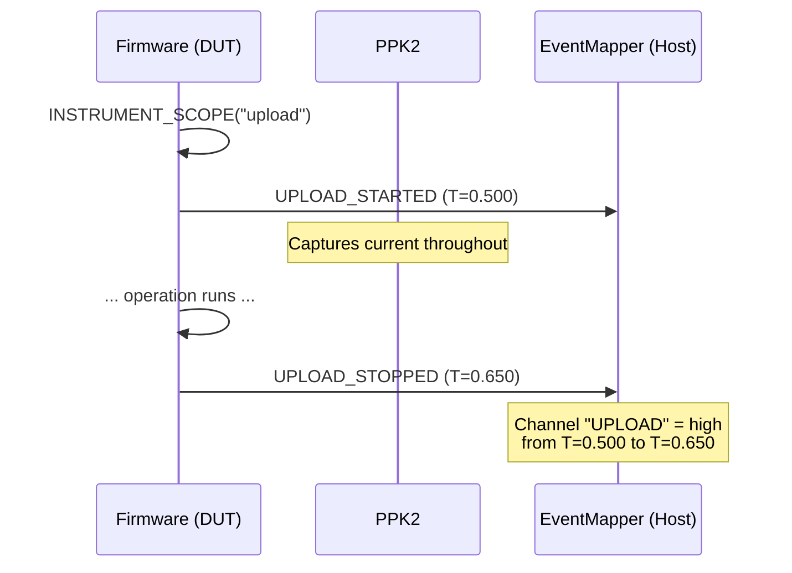
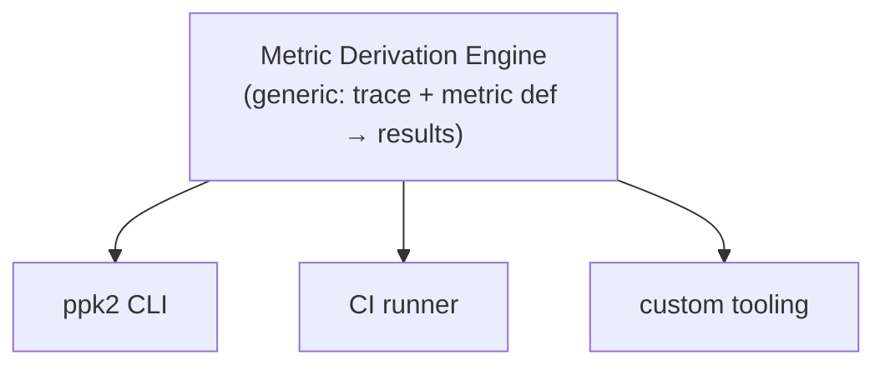

# PPK2 Python — Unreleased Features

These sections are planned but not yet released. They are parked here pending research into existing instrumentation and metrics gathering solutions.

---

## Glossary — Firmware Instrumentation Concepts

| Term | Definition |
|------|-----------|
| **Execution log** | The hierarchical record of application actions, produced by scoped instrumentation. The backbone onto which metric layers (energy, memory, filesystem, CPU, transport) are pinned. |
| **Scope** | A named entry/exit pair in the execution log. RAII guard in firmware, maps to a logical channel in PPK2 captures. |
| **Metric layer** | A measurement system pinned onto scopes. Each layer is independent and opt-in. Energy (PPK2) is one layer; memory, filesystem wear, CPU time, and transport usage are others. |
| **Tracer** | The injectable interface (`ITracer`) that firmware services use to emit scopes. Implementations: no-op (production), serial (Chrome Trace Format), GPIO (PPK2 digital inputs), or composite. |
| **Chrome Trace Format** | JSON format for execution traces, viewable in `chrome://tracing` or [ui.perfetto.dev](https://ui.perfetto.dev). Events: B/E (begin/end scopes), X (complete duration), C (counters), M (metadata). Each RTOS task gets a swim lane. |
| **Introspection** | Runtime observation of a service's internal state. Implemented separately from the service — external adapters that can reshape data types and apply custom transforms. |

---

## Firmware Instrumentation Integration

### The instrumentation hierarchy as execution backbone

The firmware instruments its key operations with scoped entry/exit guards. This creates a structured **execution log** — a hierarchical record of what the application is doing at every moment. The hierarchy is the backbone; it exists independently of any metrics.

```
wake_cycle
  ├── gps_fix
  ├── sensor_read
  │     ├── imu_sample
  │     └── rfid_check
  ├── upload
  │     ├── fs_read
  │     ├── binary_fill
  │     └── web_put
  └── idle
```

On its own, this answers operational questions: *How often is the RFID being checked? Does it only happen at the required interval? How long does a GPS fix take? How many uploads happen per wake cycle?*

### Metric layers pinned onto scopes

Because every scope has a well-defined entry and exit, **resource metrics can be attributed to any scope** — layered on when needed, without changing the instrumentation itself:

| Metric layer | What it measures | How it's attributed |
|--------------|-----------------|---------------------|
| **Energy** (PPK2) | Current/charge consumed | PPK2 ADC samples correlated with scope state |
| **Memory** | Heap high-water mark, allocations | Heap tracking hooks at scope entry/exit |
| **Filesystem** | Bytes written/erased, wear | FS operation counters attributed to scope |
| **Processor** | CPU time, idle ratio | Timer delta at scope entry/exit |
| **Notecard transport** | Bytes over I2C/serial/AUX | Request/response sizes attributed to scope |
| **Notecard data** | Cellular bytes consumed | Notehub usage attributed to scope |

Each layer is independent. The execution log itself (scope entry/exit events) is always-on and near-zero cost. The metric layers each add overhead (memory for counters, CPU for sampling, I/O for reporting), so which layers are active must be controllable:

- **Build-time** — compile out entire layers for release builds
- **Runtime config** — enable/disable layers via Notehub environment variables or serial commands, without reflashing
- **Runtime API** — programmatic control for test orchestrators and automated profiling sessions

The default production build runs with the execution log only. Metric layers are enabled selectively — energy when a PPK2 is connected, memory when investigating a leak, filesystem wear when diagnosing flash degradation. Existing profiling tools (e.g. Zephyr's `CONFIG_TRACING`, ESP-IDF's `esp_timer` profiling, ARM's ITM/SWO trace) provide good models for low-overhead, configurable instrumentation.

This lets you ask questions across layers: *"How much energy does a typical upload cost?"*, *"Does a GPS fix use more power when BLE is connected?"*, *"Which operation is responsible for the filesystem wear?"*

### The execution trace as the primary artifact

The Chrome Trace Format execution log is the primary artifact. PPK2 power data is one metric layer attached to it — alongside heap usage, filesystem wear, notecard transport bytes, and any other metric layer.

This inverts the traditional PPK2 workflow:



The PPK2's GPIO digital inputs can still be used for precise timing alignment (sub-microsecond scope boundaries), but scope *naming* comes from the serial trace. The GPIO channels become a timing refinement layer, not the primary channel source.

### Scopes as PPK2 logical channels

Each instrumentation scope maps directly to a logical channel in the PPK2 capture. Scope entry emits a START event; scope exit emits a STOP event:



Nested scopes produce multiple simultaneous channels — during the `fs_read` sub-phase of `upload`, both `UPLOAD` and `FS_READ` channels are high. The channel encoding (state table) captures whatever combinations actually occur.

### Trace as universal timeline

The Chrome Trace Format supports counter events (`ph:"C"`) that render as time-series graphs alongside scope swim lanes in Perfetto UI. Any metric that changes over time becomes a counter track, time-aligned with the execution scopes that caused the changes:

| Counter track | Source | Unit |
|---------------|--------|------|
| `current_ua` | PPK2 (downsampled from 100 kHz to ~1 kHz) | µA |
| `heap_free` | Firmware heap hooks | bytes |
| `fs_sectors_written` | Filesystem instrumentation | count |
| `notecard_bytes_tx` | Notecard transport layer | bytes |
| `battery_mv` | Fuel gauge readings | mV |
| `queue_depth` | FreeRTOS queue monitoring | count |
| `retry_count` | Application retry logic | count |

The host collector merges metric sources into a single trace file:

```
ppk2 merge trace.json capture.ppk2 -o integrated.json
```

This time-aligns and downsamples the PPK2 data into Chrome Trace counter events. The result opens in Perfetto UI with scope swim lanes + all metric graphs in one view. Full-resolution PPK2 data stays in the `.ppk2` file for detailed power analysis; the trace file carries a downsampled overview for correlation.

### Trace-integrated reports

The ppk2-python reporter can import Chrome Trace Format files and correlate scopes with power samples by timestamp. This produces a unified view: the execution timeline with power (and other metrics) overlaid per scope. Perfetto UI remains available for deep-dive analysis of the raw trace.

### Event emission

The firmware event library provides two emission modes:

| Mode | Mechanism | Latency | Use case |
|------|-----------|---------|----------|
| **Serial** | `T=<timestamp> <NAME>_STARTED` | ~1 ms | Default. Works over any serial transport. EventMapper timestamps from host clock. |
| **GPIO** | Toggle a digital pin | ~1 µs | When available. PPK2 reads directly via digital inputs. Zero host involvement. |
| **Both** | Serial + GPIO simultaneously | ~1 µs (GPIO), ~1 ms (serial) | GPIO for precise timing, serial for channel naming. |

GPIO mode uses the PPK2's physical digital inputs (D0–D7 or D0–D15) directly — no EventMapper needed for those channels. Serial mode supports unlimited channels via the state table encoding.

---

## From Bench to Fleet — Same Pattern, Different Scale

The derive → validate model applies beyond bench testing. The same conceptual framework covers production fleet monitoring — the difference is data source and time scale, not the analysis model.

### The pattern at each scale

| | Bench (PPK2 + trace) | Fleet (Notehub + events) |
|---|---|---|
| **Event source** | Firmware trace over serial | Notehub event stream |
| **Scope** | `INSTRUMENT_SCOPE("upload")` — microseconds to seconds | Time between welfare publishes — minutes to hours |
| **Metric derivation** | Charge per upload, peak current, heap delta | Event rate per device, route latency, battery trend |
| **Threshold validation** | Upload charge < 0.8 mC | Event gap < 2× publish interval |
| **Counter tracks** | Current (µA), heap (bytes), transport (bytes) | Battery voltage (mV), RSSI (dBm), route latency (ms) |
| **Anomaly** | Upload peak exceeded threshold | Device went silent |
| **Resolution** | 100 kHz samples, µs scopes | Events per hour/day |
| **Cardinality** | Single device, controlled | Fleet of devices, uncontrolled |

### Fleet metric examples

```yaml
# fleet_metrics.yaml
per_device:
  event_rate:
    - mean_per_day
    - gap_max_hours
  battery_voltage:
    - min
    - trend_slope_mv_per_day
  route_latency:
    - p95_ms
    - error_rate

per_route:
  processing_time:
    - p95_ms
    - error_count
  throughput:
    - events_per_hour
```

```yaml
# fleet_thresholds.yaml
event_rate:
  gap_max_hours: { max: 4 }
battery_voltage:
  min: { gte: 3200, severity: warning }
  trend_slope_mv_per_day: { gte: -50 }
route_latency:
  p95_ms: { max: 5000 }
  error_rate: { max: 0.01 }
```

### Context-aware suppression

Fleet monitoring requires context that bench testing doesn't — don't alert on missing events if the device's last report showed battery below charging threshold, or if it's in a known low-coverage area. The scoped model helps: the device's most recent event carries context (battery state, signal strength, firmware version) that the validator can use to suppress or downgrade alerts.

### Shared infrastructure

The metric derivation engine is generic enough to serve both domains. A bench trace and a Notehub event stream are both "scoped events with counter data" — the engine computes aggregates over scoped intervals regardless of the source. The data ingestion differs (serial capture vs cloud API), and fleet monitoring adds alerting/notification infrastructure, but the metric definition and threshold DSL can be the same.

---

## Perfetto Integration (Report Visualization)

- **Perfetto link** — for captures backed by a trace file, a deep link to Perfetto UI with pre-configured view

## Generic Metric Derivation Engine

The metric derivation engine is a generic tool: it takes a trace and a metric definition, and outputs structured results. It doesn't know about power — it computes aggregates over counter tracks within scope boundaries. The ppk2 CLI wraps it with power-specific defaults (current metrics, charge computation), but the same engine can derive heap metrics, transport bytes, or any other counter tracked in a trace.



When backed by a Perfetto trace (with counter tracks for power and other metrics), derivation runs as SQL queries against the trace processor. When backed by a `.ppk2` file directly, derivation runs in Python against the sample array.
